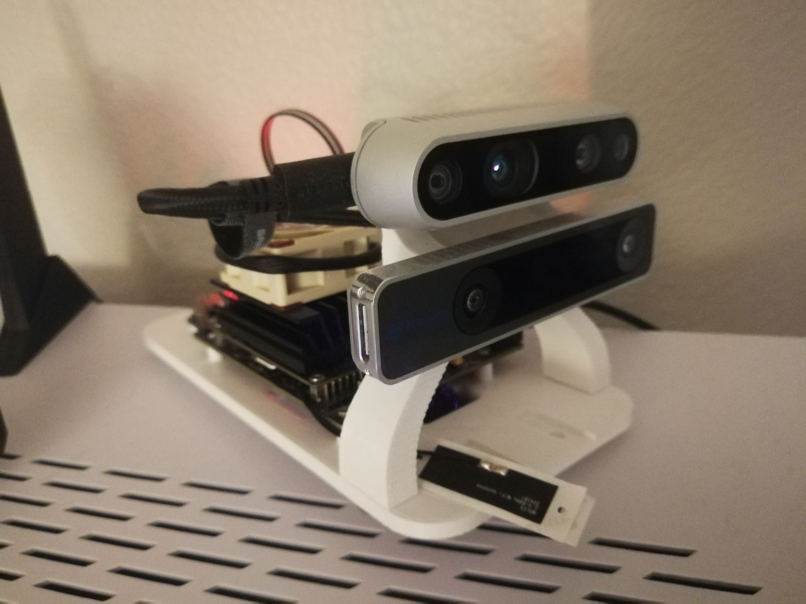
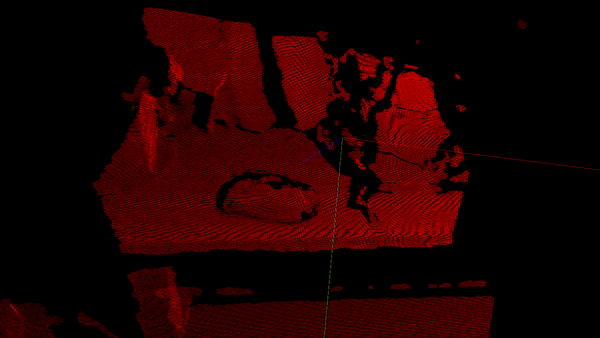
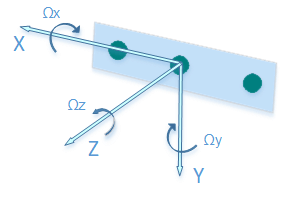
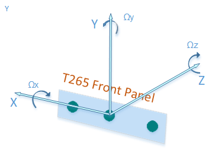

# My App practice

The setup:



Trying to make a 3d scanner for now. Some basic results



# Requirements

* Python enviornment, pyenv: [instructions](https://github.com/yosoufe/instructions/blob/main/python/pyenv.md)
* Install realsense: follow the realsense guidelines. I have documented how I compiled it in [here](https://github.com/yosoufe/instructions/blob/main/realsense/realsense.md.)
* Install Pangolin: [instructions](https://github.com/yosoufe/instructions/blob/main/pangolin.md)
* opencv for calibratiom: [instructions](https://github.com/yosoufe/instructions/blob/main/opencv.md)

#### Other stuff
```bash
python3 -m pip install -U numpy --no-cache-dir --no-binary numpy
python -m pip install transformations\
    wheel \
    matplotlib\
    PyOpenGL
```

## About the sensors

### D435i
According to [realsense github wiki page](https://github.com/IntelRealSense/librealsense/wiki/Projection-in-RealSense-SDK-2.0#point-coordinates) the **D435i** output is as follow:

> Point Coordinates: Each stream of images provided by this SDK is also associated with a separate 3D coordinate space, specified in meters, with the coordinate [0,0,0] referring to the center of the physical imager. Within this space, the positive x-axis points to the right, the positive y-axis points down, and the positive z-axis points forward. Coordinates within this space are referred to as "points", and are used to describe locations within 3D space that might be visible within a particular image.



### T265
According to [this intel blog](https://www.intelrealsense.com/how-to-getting-imu-data-from-d435i-and-t265/) the **T265** output is as follow:

> To aid AR/VR integration, the TM265 tracking device uses the defacto VR framework standard coordinate system instead of the SDK standard:



> 1. Positive X direction is towards right imager
> 2. Positive Y direction is upwards toward the top of the device
> 3. Positive Z direction is inwards toward the back of the device

> The center of tracking corresponds to the center location between the right and left monochrome imagers on the device.


## Increase performance on jetson
```bash
sudo iwconfig wlan0 power off # turn of the wifi's power management
sudo jetson_clocks # max up the clock speed
sudo sh -c 'echo 255 > /sys/devices/pwm-fan/target_pwm' # turn on the fan
```

## VNC on Jetson
- https://medium.com/@bharathsudharsan023/jetson-nano-remote-vnc-access-d1e71c82492b
- https://developer.nvidia.com/embedded/learn/tutorials/vnc-setup


## Calibration
```
cd tests
python test_calibrate.py --SN_T265 948422110533 --SN_D4xx 938422070309 --grid_H 6  --grid_W 4 --visualize --size 29.85
```

Of course you need to chagne the serial numbers according to your sensors. Use `rs-enumerate-devices` from realsense 
library to find out serial numbers of your sensors.


# Next step
Okay, calibrations is working but the results after the calibration is not 
any better. This either means the calibration is actually not working, or 
the error that I currently see is not bevause of the calibration issues or
the error that is caused by uncalibrated system is not visible due to errors
of the T265 pose measurement. So what now?

Now I would like to invest some time on learning comen techniques for pointcloud
registeration methods. I found [this video](https://youtu.be/uwNdLdRozeA)
and [this video](https://youtu.be/lRENNVC-FjM) which is talking about a 
registeration method and also an overview of some of methods. 

[PCL](https://pcl.readthedocs.io/projects/tutorials/en/latest/registration_api.html#registration-api) and
[Open3d](http://www.open3d.org/docs/release/tutorial/pipelines/global_registration.html) have wonderful documentation about registeration.

Registeration needs features as an input. And is talking about Open3d library 
offering some feature extraction method like FPFH
also 3DSmoothNet.

Here are some links to learn more about features from PCL library:
- https://pcl.readthedocs.io/projects/tutorials/en/latest/index.html#features
- https://pcl.readthedocs.io/projects/tutorials/en/latest/fpfh_estimation.html

So lets start with learning about features in 3d point cloud.